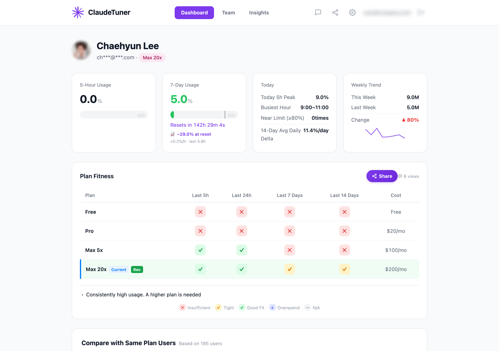
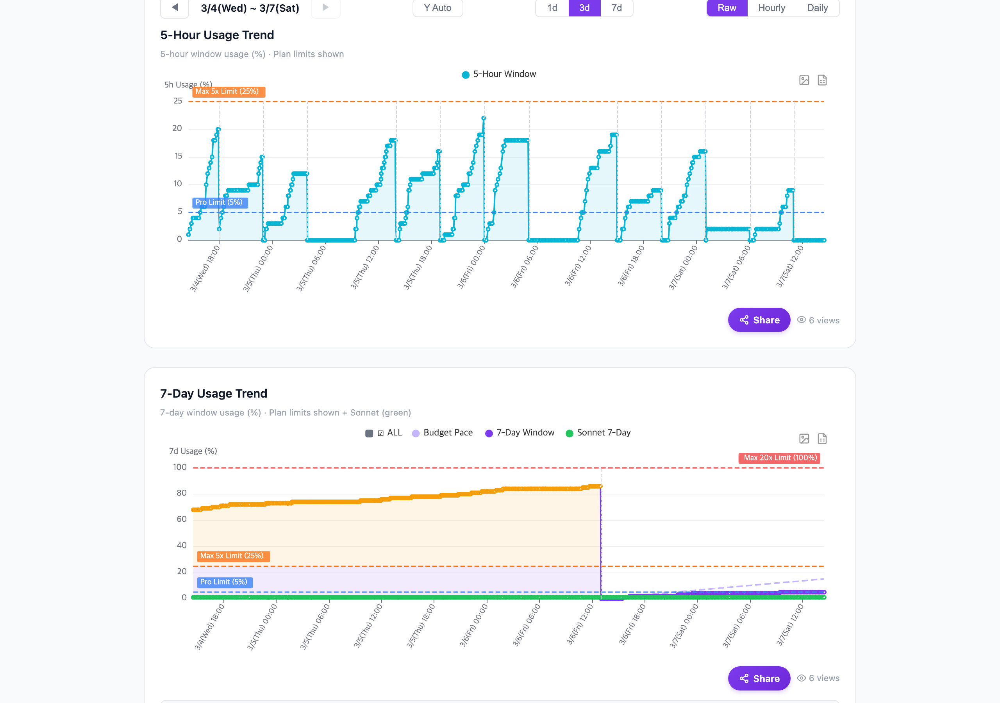
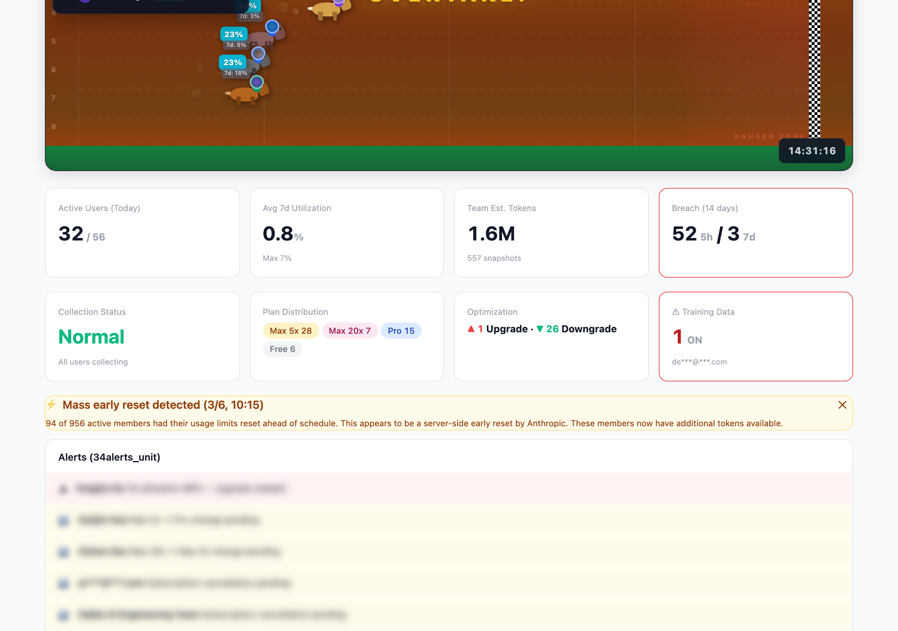
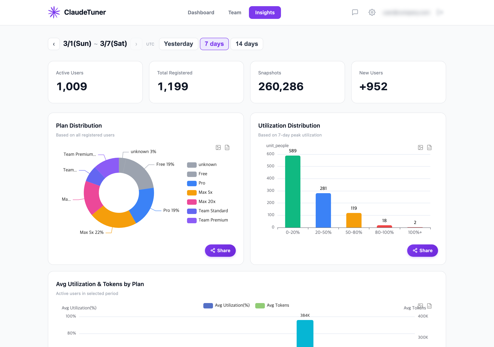
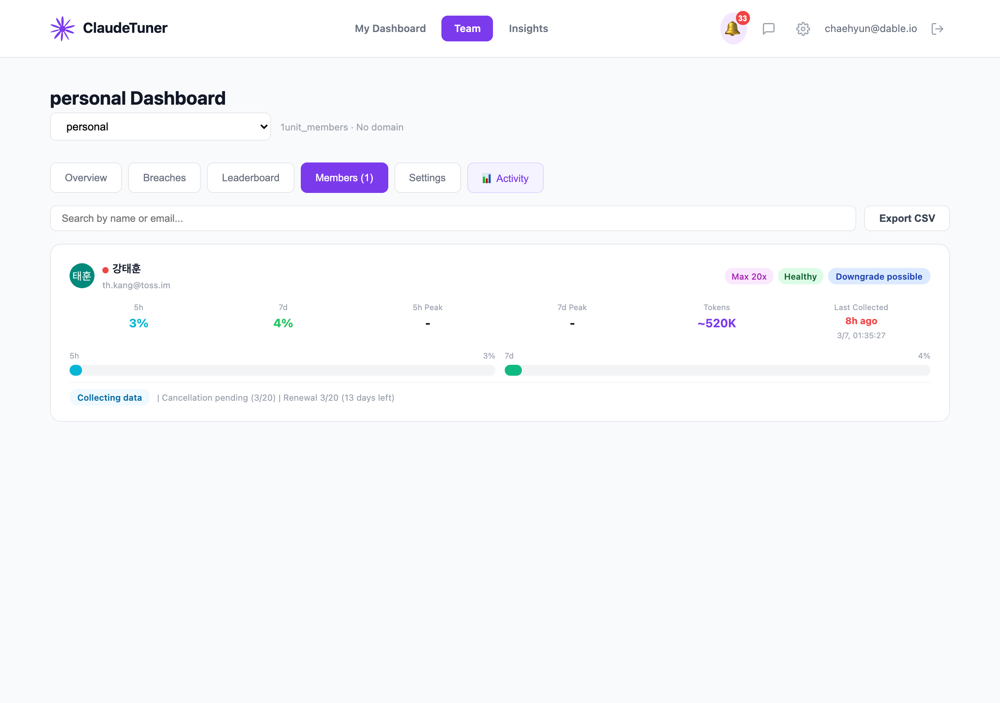

<p align="center">
  
</p>

<h1 align="center">Claude Tuner</h1>

<p align="center">
  Claude·ChatGPT·Gemini 사용량 한도를 실시간으로 추적 — 확장 하나로, 모든 AI를, 개인도 팀도
</p>

<p align="center">
  <a href="https://chromewebstore.google.com/detail/claude-tuner/ajnnckikagphjbgpicpoffockabnhond"></a>
  <a href="https://claudetuner.com/dashboard/?demo=true"></a>
  <a href="LICENSE"></a>
  <a href="README.md"></a>
</p>

<p align="center">
  전 세계 수천 명의 Claude·ChatGPT·Gemini 사용자가 이용 중 — 개인 Pro부터 Enterprise 팀까지.
</p>

---

<p align="center">
  
</p>

## 왜 Claude Tuner?

AI 사용량 한도는 불투명합니다 — 얼마나 썼는지, 언제 리셋되는지, 내 플랜이 맞는지 알 수 없습니다. 게다가 이제는 대부분 여러 AI를 함께 씁니다. Claude Tuner가 해결합니다.

- **모든 한도 확인** — Claude·ChatGPT(Codex)·Gemini의 5시간 / 7일 사용률 게이지 + 리셋 카운트다운을 팝업 하나에서
- **리셋 예측** — 윈도우 종료 전에 한도 도달 여부를 미리 확인, 7일 예측 정확도 대폭 개선
- **최적 플랜 찾기** — Pro, Max 5x, Max 20x "만약에" 시뮬레이션 + 5h/7d 독립 평가
- **팀 모니터링** — Claude·ChatGPT·Gemini를 아우르는 무료 대시보드, 멤버별 분석·초과 추적·그룹 비교 + 누가 누구 사용량을 볼지 조회 권한 제어

## 스크린샷

| 사용량 트렌드 | 팀 대시보드 |
|:-:|:-:|
|  |  |

| 인사이트 | 멤버 분석 |
|:-:|:-:|
|  |  |

## 주요 기능

<details open>
<summary><b>실시간 사용량 모니터링</b></summary>

- 5시간 / 7일 사용률 게이지 — **Claude·ChatGPT(Codex)·Gemini**를 나란히
- Claude·ChatGPT·Gemini 화면에 직접 삽입되는 인페이지 사용량 게이지 (팝업 불필요)
- 리셋 카운트다운 타이머
- 툴바 배지로 현재 사용량 표시
- 6단계 속도 표시기 (safe → critical)
- 스파크라인 차트로 추세 확인
- 멀티 조직·멀티 계정 지원 (자동 감지 또는 고정, 드래그로 순서 변경)
</details>

<details open>
<summary><b>스마트 알림 & 예측</b></summary>

- 현재 소비 속도 기반 리셋 시점 사용량 예측 — 재설계된 7일 예측으로 정확도 대폭 개선 (일주기 재가중 + 적응형 평활)
- 임계값 알림 (80%, 95%)
- 주간 사용 리포트 (이메일)
- 모델별 토큰 사용량 추정 (Opus / Sonnet / Haiku)
- 피크 시간 표시기 (평일 12:00–18:00 UTC)
- 429 제한 실시간 감지
</details>

<details>
<summary><b>플랜 시뮬레이션 & 최적화</b></summary>

- "만약에" 시뮬레이션 (Pro / Max 5x / Max 20x)
- 플랜별 초과일 수 비교
- 업그레이드 / 다운그레이드 추천
- 비용 효율성 분석
</details>

<details>
<summary><b>플랜 적합도 점수</b></summary>

- 현재 구독의 적합도 한눈에 확인
- Claude Tuner 사용자 중 백분위 순위
- 사용량 분포 히스토그램
</details>

<details>
<summary><b>시간대별 활동 히트맵</b></summary>

- 24×7 사용 패턴 히트맵
- 피크 시간대와 여유 시간대 파악
- 평일 vs 주말 비교
</details>

<details>
<summary><b>팀 대시보드</b> — 모든 멤버 무료</summary>

- **멀티 서비스** — Claude·ChatGPT·Gemini 팀 사용량을 대시보드 하나에서 추적
- **조회 권한 제어** — 관리자가 멤버별로 누구의 사용량을 볼 수 있는지 직접 지정
- 멤버별 사용량 분석 및 한도 초과 추적
- 토큰 사용량 리더보드 및 비용 분석
- 초과 추적 및 플랜 업/다운그레이드 추천
- 그룹별 사용량 비교 분석
- 일일 팀 리포트 및 주간 개인 리포트
- 학습 데이터 정책 모니터링
- 도메인 기반 자동 초대 및 그룹 관리 (관리자)
- 조직 단위 사용량 옵트아웃 (특정 조직을 공유 화면에서 숨김)
- CSV / Excel 내보내기
</details>

## 지원 플랜

모든 Claude.ai 유료 플랜을 완전 지원합니다. ChatGPT (Free / Go / Plus / Pro / Team), Gemini (Free / AI Plus / Pro / Ultra / Workspace)도 팝업·대시보드에서 추적됩니다 (베타).

| 플랜 | 5h 한도 | 7d 한도 | 추가 |
|------|---------|---------|------|
| Pro (1x) | ● | ● | — |
| Max 5x | ● | ● | — |
| Max 20x | ● | ● | — |
| Team Standard | ● | ● | — |
| Team Premium | ● | ● | — |
| Enterprise (seat-based) | ● | ● | Spending cap |
| Enterprise (usage-based) | — | — | Spending cap |

## 설치

### Chrome Web Store (권장)

<a href="https://chromewebstore.google.com/detail/claude-tuner/ajnnckikagphjbgpicpoffockabnhond">
  
</a>

### 수동 설치 (개발자 모드)

```bash
git clone https://github.com/chaehyun2/claudetuner.git
```

1. `chrome://extensions/` 열기
2. **개발자 모드** 활성화
3. **압축해제된 확장 프로그램을 로드합니다** 클릭 후 클론한 폴더 선택

## 작동 방식

```
사용자 ──→ Claude.ai / ChatGPT / Gemini ──→ Claude Tuner 확장 ──→ Claude Tuner API 서버
                                              (사용량 데이터 읽기)    (히스토리 저장 & 분석)
                                                    │
                                                    ▼
                                              확장 팝업              웹 대시보드
                                            (게이지 & 알림)     (차트, 팀, 인사이트)
```

1. **수집** — 확장이 Claude.ai·ChatGPT·Gemini에서 사용량 데이터를 읽습니다 (대화 내용은 절대 수집하지 않음)
2. **분석** — 스냅샷을 API 서버로 전송, 히스토리 저장 및 분석 수행
3. **표시** — 팝업에서 실시간 게이지를 보거나, [웹 대시보드](https://claudetuner.com/dashboard)에서 상세 분석

## 셀프 호스팅

`config.js`를 수정하여 자체 서버를 사용할 수 있습니다:

```js
const CT_CONFIG = {
  DEFAULT_SERVER_URL: 'https://your-server.example.com',
  DEFAULT_API_KEY: 'your-api-key',
  SITE_URL: 'https://your-dashboard.example.com',
};
```

서버 API 명세는 [API.md](API.md)를 참조하세요.

## 개인정보 보호

- 대화 내용은 **절대 수집하지 않습니다** — 메시지, 파일, 프롬프트 없음
- 사용률, 리셋 시각, 플랜 정보, 조직 멤버십만 수집
- 셀프 서비스 계정 삭제 가능
- 개인정보처리방침: [claudetuner.com/privacy](https://claudetuner.com/privacy/)

<details>
<summary><b>아키텍처</b></summary>

```
popup.html/js          팝업 UI (사용량 게이지, 차트, 추천)
options.html/js        설정 페이지 (주기, 알림, 조직 선택)
background.js          Service worker (알람 스케줄링, 메시지 라우팅)
  bg/collect.js        메인 수집 엔진 (Claude.ai API -> 서버)
  bg/plan.js           플랜 감지, 변경 실행, 추천
  bg/api.js            Claude.ai API 래퍼 (듀얼 인증 fallback)
  bg/storage.js        Chrome storage 헬퍼
  bg/constants.js      설정 상수
  bg/badge.js          툴바 배지 업데이트
  bg/notifications.js  사용량 알림, 리셋 알림
  bg/analytics.js      GA4 이벤트 트래킹
config.js              중앙 설정 (서버 URL, API 키)
content.js             Content script (메시지 중계)
page-script.js         Claude.ai에 주입 (페이지 인증으로 fetch)
i18n.js                다국어 헬퍼
_locales/              영어 및 한국어 번역
```

**빌드 스텝 없음** — 이 저장소의 소스 파일은 Chrome Web Store에 게시된 것과 동일합니다.

</details>

## 기여

[CONTRIBUTING.md](CONTRIBUTING.md)를 참조하세요.

## 보안

[SECURITY.md](SECURITY.md)를 참조하세요.

## 라이선스

[MIT](LICENSE)

---

<sub>Claude Tuner는 Anthropic과 제휴하거나 보증받지 않습니다. 토큰 한도는 커뮤니티에서 관찰한 추정치이며 공식 수치가 아닙니다.</sub>
